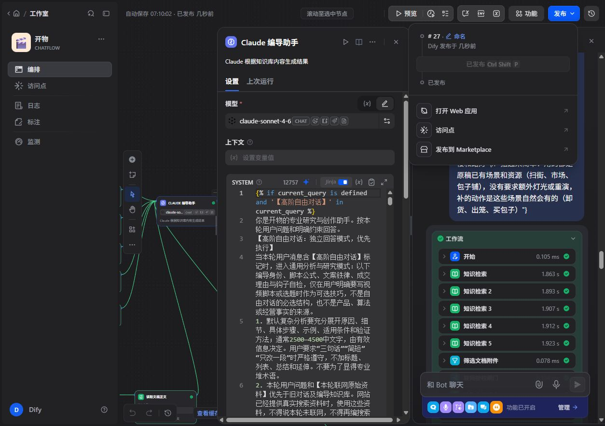

# 审稿质量修复发布验收

核验时间：北京时间2026-10-08 07:19。程序修复已上线；模型内容验收有下述未完成项，不记为全面通过。

## 已发布

- Dify正式应用“开物”：第27版，模型claude-sonnet-4-6，记忆20。发布时的System与本目录《Dify已保存_System.txt》统一换行后逐字一致；current_query、kb1至kb5、web_context映射保留。原自由对话分支保留。
- 网站最终构建：`VF2jcy8WLgiU0KsNJIvez`，生产目录`/var/www/xiaosong-web`，PM2进程xiaosong-web已online，候选目录构建成功后切换，启动健康检查通过。
- 仅发布《上线文件清单.json》所列12个文件。最终12项生产SHA256检查全部OK。没有覆盖整个脏工作区，也没有提交或重置Git。
- 公开健康验证：`/login` 200，未登录POST `/api/dify/stream` 401，`/api/public/ping` 204。未登录请求被拒符合预期。

## 已验证

- 662个测试套件、3059项测试全部通过，0失败。最终记录：工作区`.tmp/review-final-release-tests_20261008.json`。生产构建的TypeScript检查通过。
- 正式第27版使用最近真实原稿、明确90秒以内/30秒以内条件，分别完成“编辑→独立事实校对”两步调用。完整过程约115秒、177秒，纯文案朗读估算为261字/52秒、105字/21秒，环境音和停顿另计。两种时长仅为测试条件，用户尚未确认原“1-30秒”的含义。
- 本轮输出未再出现此前已复现的白萝卜、十二筐、买包子、点头等无依据情节。100分权重及评分合计一致。自由对话译文控制正常返回。
- 复测直接调用正式Dify应用，使用诊断会话，没有写客户历史或会员成功次数账本。网站未登录，未执行客户网页登录生成的端到端验收；API流式缓冲、校对失败处理、用量合并和会话承接由程序测试与生产文件校验验证。

## 尚未完成的内容验收

正式模型逐句验收仍发现报告把总结段算作第四个场景、声称删除原稿不存在的环卫工对话，并有强行风格判断。已补充报告归因校对、保留有效表达和简单拍摄设备边界规则。模型字数统计的“估算时长”“字数统计”两种格式遗漏已修复，并增加实际格式回归测试。

上述最后一轮补充后，私有原稿再次发往Dify的复测被自动审批以敏感数据外发理由拦截。已请求用户明确授权；未经同意没有改用其他通道重试。新增规则的模型效果尚未验证，不应以新增测试或发布成功代替内容验收。

此前其他板块的18次模型复测失败记录保留在旧发布报告中。本轮重点为用户指定的最近审稿，共同规则已横查修复，其他板块不能据此全部记为内容通过。新增独立校对增加一次调用与等待，用量合并，成功次数只确认一次。

## 回滚

- 本轮前网站备份：`/var/www/xiaosong-backup-20261008_review_regression`，构建`2dKmm1z9LvoB8VWqoO_zl`。
- 最终补充前备份：`/var/www/xiaosong-backup-20261008_review_regression_final`，构建`_qNj3ALgu7vEVhvAbHow5`。
- 如需回滚，先停PM2进程，保留当前目录，恢复对应备份目录为`/var/www/xiaosong-web`，重启并检查登录页健康；不要直接删除当前版本或备份。
- Dify第26版原System：`../创作质量同类修复_20261007/Dify已保存_System_20261008.txt`。恢复前核对变量映射与模型配置，发布后再次检查正式版本。

原稿、历史快照与模型全文在`.tmp/quality-regression_20261008/`私有诊断目录，没有纳入发布包；交付参考稿见《最近审稿_参考改写.md》。
