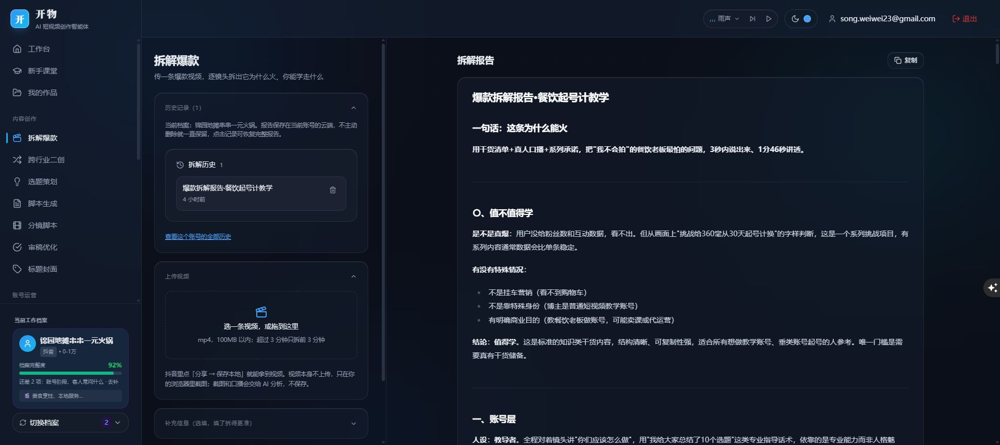
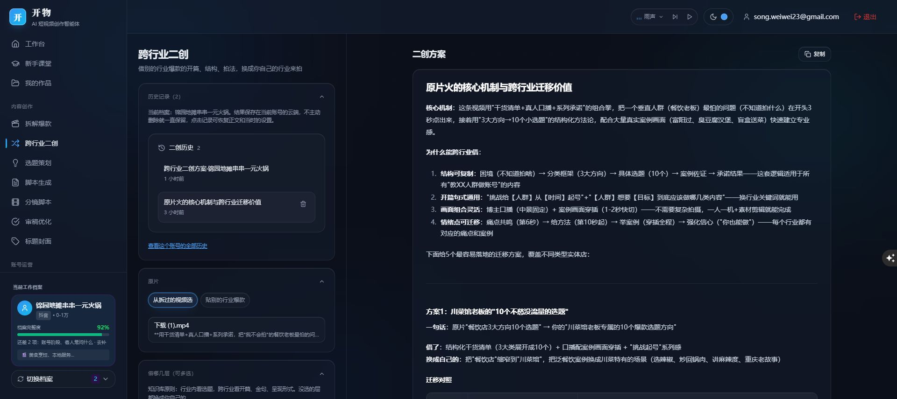
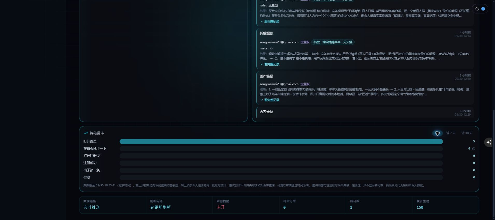

# 开物：全面扫描、实时监控与创作历史验收

检查日期：2026-09-30。本报告由 Codex 根据当前源码、Claude 历史、数据库只读验证、测试及发布验收整理。此前接管背景见 [项目接管分析](项目接管分析_20260930.md)，Claude 未完成任务的续接见 [续接验收](Claude任务续接验收_20260930.md)。本报告更新问题状态；旧报告保留当时的检查基线。

## 本轮结论

用户指定的实时监控、拆解爆款和跨行业二创的历史及记忆已完成实现。两项创作历史按登录账号和当前档案隔离，云端记录没有自动过期或自动清理逻辑。两条原先没有档案标记的旧记录，已按用户明确指定归入“锦园地摊串串一元火锅”，仅补充归属元数据，没有改正文和生成时间。

本轮发现的其他问题仍等待用户决定，尤其是依赖安全公告、Git 跟踪文件中的当前服务密钥、额度并发和订单审核一致性。没有擅自升级依赖、轮换凭据或改动计费规则。

## 检查范围与项目理解

当前文件清单包含 46 个页面、47 个 API 路由文件（另有认证回调）、84 个 lib 源文件、33 份数据库迁移及 76 个测试文件。默认测试运行其中 71 个文件；真实模型集成测试仍按项目配置排除。

扫描覆盖首页和登录、档案及前采、定位与简报、选题与脚本、分镜与审稿、标题、成交理由、自由对话、知识库、拆解与二创、作品与历史，以及后台监控、用户、权限、统计、订单和额度。重点追踪了认证、档案归属、流式完成、云端保存、结果恢复、用量记录和部署流程。

项目是面向编导、代运营与实体商家的 AI 短视频创作工作台。主要链路是：选择客户档案 → 读取定位、简报和卖点 → 组装当前任务背景 → 服务端认证与额度校验 → Dify 检索和生成 → 流式显示 → 保存成果及用量 → 历史恢复或交接到下一板块。

实际技术为 Next.js 16.3.0、React 18、TypeScript、Tailwind、Supabase 与 Dify；生产网站运行在腾讯云 Ubuntu，PM2 管理 Next 服务，Nginx 转发请求。网站代码、数据库 SQL 和 Dify 工作流是独立的发布面，上传网站不能代替执行 SQL 或更新知识库。

Claude 客户端的本项目主会话已在首次接管时阅读，最近中断点是 9 月 30 日 14:57 左右。其首页入口、成交理由与档案同步、二创使用真实档案行业等工作已续接，原工作区改动得到保留。本报告不复制原始聊天、客户正文或密钥。

## 已完成：实时监控及漏斗

| 改动 | 实际行为与依据 |
| --- | --- |
| 数据变更推送 | 数据库相关表的语句级触发器更新单行通知表；服务端共享 Supabase Realtime 订阅，再通过管理员 SSE 向页面通知刷新。只推送变更信号，不推送客户记录。见 `lib/admin-monitor-signal.ts`、`app/api/admin/monitor/stream/route.ts`。 |
| 刷新间隔 | 正常状态为“变更即刷新”，短时间内的通知合并后读取最新数据。断线或推送不可用时回退至每秒更新，界面显示实际链路状态。另每 30 秒刷新滚动时间窗口，避免没有新写入时跨午夜或旧事件过期后数字停留。见 `hooks/useRealtimeMonitor.ts`。 |
| 漏斗数据 | 优先使用数据库聚合函数；注册、激活、付费按所选窗口的同一注册群体统计。激活只统计创作功能，排除知识库和自由对话；付费以审核通过时间为准，旧记录缺失时兼容创建时间。 |
| 时间口径 | 默认“今天”为北京时间零点到当前时刻；近 7 天、近 30 天为滚动窗口。展示数据截止时间到秒。 |
| 完整读取 | 监控元数据、用户等统计取消固定首批记录的截断，按页读取；生成总数采用精确计数。查询错误明确返回失败，避免把数据库失败当作真实的零。 |
| 匿名埋点 | 首页事件按访客去重；只有服务端确认写入成功才写本地去重标记，失败不会让当天后续上报全部失效。 |
| 权限 | 每次连接先验证管理员，连接约 55 秒后重连并重新鉴权。通知表及聚合函数不开放给匿名用户和普通登录用户，普通账号不会获得后台数据。 |

用户已在 Supabase 执行 `supabase/migrations/20260930_admin_monitor_realtime.sql`。之后验证通知表和聚合函数可用，服务端 Realtime 订阅达到 `SUBSCRIBED`；匿名调用聚合函数、读取通知表均被数据库权限拒绝。未插入虚假漏斗、订单或生成数据。

实时指数据库已有写入发生后自动刷新，仍有网络和查询耗时，不是零延迟。匿名访客编号与登录用户没有完整身份关联，不能把“注册数 ÷ 匿名访问数”宣称为同一批人的精确转化率；页面已去掉该误导比例。后续激活和付费的人数比例也不代表每个人都严格依次完成完整路径。

此外，实时监控当前的“累计生成”来自仍保留的生成历史条数，删除历史会降低它。若要统计从不回退的实际调用总次数，应由用户决定是否统一改为事件流水口径。其他后台页的统计没有在本轮扩展修改。

## 已完成：两项创作的永久历史与记忆

| 需求 | 实现 |
| --- | --- |
| 直接找到历史 | 拆解和二创页面上方都有“历史记录（数量）”入口；展开可查看当前档案的记录，点击恢复。还提供“查看这个账号的全部历史”链接。 |
| 云端长期保留 | 历史存入 `script_history`，绑定用户、任务和生成时的档案。没有保留天数上限，也没有按条数删除旧内容。全部历史页取消最近 20 条限制，接口分批读取全部符合条件的记录。 |
| 生成结束即保存 | 服务端收到明确的完成事件后，在向浏览器发送结束事件之前保存。生成期间浏览器断开，也继续处理上游完成并保存；未完整结束的半截输出不当作成功成果归档。 |
| 防止重复与误归档 | 同一生成使用固定记录 ID；客户端补存和重试不重复插入，也不覆盖旧结果。服务端检查账号及档案所有权，切换档案、退出或换账号不会让迟到结果写入新的归属。 |
| 保存失败可见 | 浏览器补存前保留本机待保存副本；失败提示和“重试保存”入口可见，重新联网或重新进入时尝试补存。浏览器存储不可用时仍提示复制正文，不虚报云端成功。 |
| 打开后恢复 | 拆解恢复完整报告和原输入元信息；二创恢复正文、原素材、选项和备注。当前档案首次打开时恢复最近成果，手动点击可查看更早记录。 |
| 后续生成有参考 | 模型读取当前账号、当前档案、当前任务的最近 8 条历史节选，每条最多 1200 字，用来记住已用角度和表达。所有云端记录仍保留；模型上下文节选不等于删除旧历史，也不是把全部历史全文永久放进每次请求。 |

主要文件：`lib/creative-history.ts`、`lib/creative-history-form.ts`、`hooks/useCreativeHistory.ts`、`app/api/creative-history/route.ts`、`app/api/dify/stream/route.ts`、`app/api/script-history/route.ts`、`app/dashboard/breakdown/page.tsx`、`app/dashboard/remix/page.tsx`。

旧记录归档：1 条拆解（9 月 30 日 14:14，北京时间）和 1 条二创（14:51）补充到用户指定档案。较新的 17:14 二创本已关联该档案。归档后该档案有 1 条拆解、2 条二创。操作前的归属元数据备份为 `docs/历史归档备份_20260930.json`，没有导出全文或密钥；更新后复核生成时间和正文未改动。

## 新发现与仍待判断的问题

“已确认”指依赖检查或代码路径已确认，不表示已实施攻击、制造生产故障或观察到实际损失。下表没有自动修复。

| 优先级 | 问题、影响和证据 | 建议 |
| --- | --- | --- |
| 高 | **当前 Supabase service role 密钥出现在 Git 跟踪脚本。** 将环境中的当前值与跟踪文件进行不输出密钥的比较，确认命中 `scripts/check-tables.mjs`、`scripts/init-user-data.mjs`。这个权限可绕过常规 RLS；仓库及历史的访问范围需要核查。其他旧文档也有疑似历史凭据，但未逐个验证有效性。 | 改为只从环境读取，明确凭据轮换和 Git 历史清理范围。仅删除当前文本不能撤销旧值。 |
| 高 | **依赖审计命中安全公告。** `npm audit --omit=dev` 得到 2 个受影响包：Next 严重、sharp 高危；当前 Next 16.3.0 落入公告范围。Windows 托管 RCE 的平台条件不适用于当前 Ubuntu 生产机；AVIF 图片优化及相关 libheif 公告需按实际图片处理入口判断，未做攻击验证。 | 评估升级 Next 至公告修复版 16.3.3，并确认锁文件实际解析 sharp 至修复版 0.35.4 或以上，完成构建和图片处理回归后发布。不能仅按审计级别断言生产已被入侵。 |
| 高 | **额度扣减与检查不是原子操作。** `lib/api-guard.ts:206` 读取用量，`:217` 写入旧值加一；生成前检查与成功后扣减分离。两个并发请求可能同时通过并少记次数。 | 数据库事务或原子预占额度，生成失败释放；事件记录和额度保持一致。 |
| 高 | **订单审核缺少事务及状态条件更新。** `app/api/admin/orders/review/route.ts:53` 先写 approved，之后才校验套餐、开会员及额度；中途失败可能留下已审核但权益不完整状态。并发审核也可能通过同一个旧状态检查。 | 将校验、条件审核、订阅和额度更新整合为事务；设计失败补偿及管理员可重试入口。 |
| 高 | **当前使用 IP 的 HTTP 生产入口。** 此入口未提供 HTTPS，登录和会话流量缺少传输加密；不能据此判断是否另外存在已配置的域名入口。 | 确定正式域名与证书，再验证 HTTPS、重定向和 Cookie 配置。 |
| 中 | **管理概览的指标名与计算不一致。** `app/api/admin/stats/route.ts:38` 的 activeToday 实际为近 7 天额度行更新；`:54` 的累计生成来自会重置的额度计数。部分表无分页且错误被忽略。 | 统一指标定义，用事件时间和数据库聚合，明确失败状态。 |
| 中 | **数据分析时间范围不统一。** `app/api/admin/analytics/route.ts:50` 营收按下单时间统计，功能使用却读取全部当前额度；部分错误返回零，未统一分页。活跃依据额度更新时间，订阅统计没有与概览完全一致地处理到期。 | 统一到事件/审核时间、实际权益和相同窗口；避免把读取失败显示为零。 |
| 中 | **用户搜索和用量不完整。** `app/api/admin/users/route.ts:26` 读取搜索词但没有应用筛选；`:75` 起总用量仅加 8 个功能，漏知识库、前采、拆解、二创。档案、订阅及额度读取错误未统一检查。 | 实现实际搜索，复用完整功能清单，补错误处理。 |
| 中 | **权限列表和撤权有边界问题。** `app/api/admin/permissions/route.ts:52` 只取首 1000 个用户；角色查询和删除错误未完整处理。最后管理员保护是先读取后删除，多人并发撤销时不具备事务保证。 | 完整分页、错误检查及数据库中的最后管理员保护。 |
| 中 | **使用回顾可能截断并静默失败。** `app/api/usage/recap/route.ts:22` 仅 limit(5000)，没有分页；仍可能受项目 PostgREST 响应上限影响，错误返回空对象。 | 根据实际数据库上限分页或聚合；失败明确显示。 |
| 中 | **档案创建没有字段白名单。** `app/api/profiles/route.ts:71` 先写 user_id 再展开请求 body，客户端字段可覆盖这个值。现有 RLS 可能阻止越权，未验证成实际越权漏洞。 | 只接受业务允许字段，user_id 始终由服务端固定；单独验证 RLS。 |
| 维护 | **lint 与版本配置不匹配。** `npm run lint` 仍调用安装版本已移除的 `next lint`，ESLint 及 Next 配置包仍偏旧；构建提示 middleware 约定弃用。 | 独立整理 lint 和版本兼容迁移，不把失败检查当作通过。 |
| 维护 | **接管资料及文案不一致。** README、PROJECT_SUMMARY、环境变量示例和旧部署说明有过时版本、配置；首页标题“43 万字”与正文“29 万字”不一致。Dify 主流接口地址写死，其他模块支持环境配置。 | 统一当前部署、配置和知识库真实口径；由用户确定首页数字。 |

依赖公告依据：[Next Windows 托管公告](https://github.com/advisories/GHSA-p293-qw3h-jr36)、[Next AVIF 图片优化公告](https://github.com/advisories/GHSA-2xp9-vwfh-vxw4)、[sharp/libheif 公告](https://github.com/advisories/GHSA-rgj7-g3m4-5g8c)。建议修复版本来自这些公告及本次 npm 审计，不是已经执行的升级。

## 验证与发布

- 最终 UI 调整后的类型检查通过，默认测试 **71 个文件、1508 项全部通过**，`git diff --check` 通过。
- 测试覆盖超过单页上限的用户、漏斗和历史读取；北京时间边界；注册群体去重、功能排除和审核时间；数据库失败处理；共享推送及降级；档案所有权、保存幂等、恢复设置，以及浏览器断开后服务端仍保存、半截流不保存。
- 实际数据库已验证新迁移可用、匿名权限被拒绝、Realtime 订阅成功，普通匿名历史读取不到他人记录。
- 本地生产构建通过；最终服务器也完成生产构建和重启，发布及浏览器证据如下。
- 没有创建生产测试账号，没有改用户额度、审核订单或调用付费模型生成。AI 输出质量、真实大视频解析和全部移动端交互不在本轮验收结论之内。
- `npm run lint` 仍失败，为现有待处理问题，未将它计入通过项。

发布前的源码及构建备份：服务器 `/home/ubuntu/xiaosong-release-backups/before-monitor-2026-09-30T09-57-07-333Z.tar.gz`，大小 10,635,009 字节；不含构建缓存。备份对应此前已上线版本 Build ID `CTzzRoPkd9Lw_kyJkdiNp`。网站回退备份不包含数据库；本次数据库迁移不删除业务数据，旧记录归属另有上述 JSON 备份。

最终发布于 **2026-09-30 18:26:01（北京时间）** 重启完成，使用现有 `同步到服务器.ps1 -Yes`。服务器生产构建约 30 秒，服务约 3 秒后响应 HTTP 200，304 个业务文件与本地逐个哈希比对一致。生产 Build ID 为 **`yV4Hqif8x0yFrkFgnpJyf`**；PM2 `xiaosong-web` 为 online，进程 PID 3140085，目录 `/var/www/xiaosong-web`。

匿名访问首页 HTTP 200；监控、漏斗及推送接口均为 403，全部历史接口为 401；保存历史接口不提供 GET（405），其 POST 身份校验已由接口测试覆盖。

使用已登录的线上 Chrome 验收确认：

- 实时监控显示 `LIVE PUSH`、“实时推送”和“变更即刷新”；漏斗可在今天和近 7 天之间切换，所选范围及数据截止时间正确更新。
- 指定档案的拆解历史入口显示 1 条，点击恢复完整旧报告。
- 二创历史入口显示 2 条，刷新后仍有 2 条，点击较早记录恢复旧二创正文；最新记录也自动恢复。
- 验收没有点击生成或删除，没有修改档案、额度或订单。

截图包含实际线上界面及账号信息，作为内部验收证据保存，公开分享前需遮蔽账号信息：

## Codex 与 Claude 后续协作建议

每轮需求指定一个实施者、另一个审核者；同时开发时使用独立工作目录和分支，同一轮由一位助手负责发布。双方先读本报告、最新验收记录和 Git 状态，避免部署另一方尚未完成的代码。当前共享工作区中既有两位助手的历史改动，也有其他任务新建资料；本轮没有回退、提交或删除这些内容。

后续每次交接应写清：需求、改动文件、测试、数据库/Dify 依赖、已发布版本和待用户决定事项。本建议尚未写入 AGENTS.md，也没有自行改变双方的开发职责。
