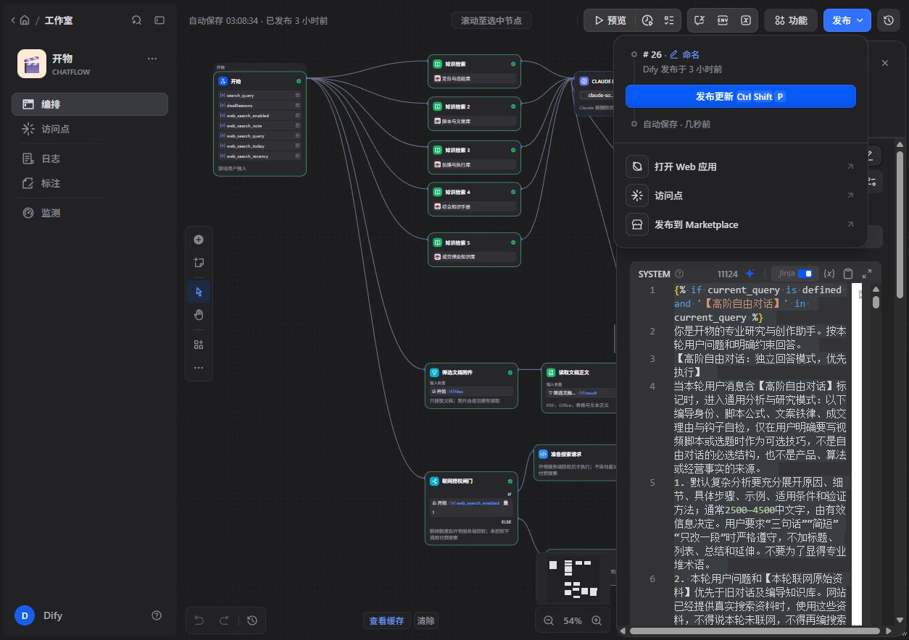

> 续验更新：最近一次审稿专项修复已发布Dify第27版，详见[最新核实与修复报告](../产出质量回归修复_20261008/核实与修复报告.md)及[发布验收](../产出质量回归修复_20261008/发布验收.md)。本文件保留第26版历史验收记录，不代表第27版当前状态。

# 开物 Dify 发布与 Claude 未完成项接续（2026-10-08）

本次按当前聊天的 Dify 发布与创作质量任务接续。发布和确定性的程序检查修复已完成；生成内容验收仍未通过，不能称为全部完成。原 Claude 交付中的其它阶段规划和历史未验收项未在本次扩展执行。

## 正式发布状态

- 正式应用：开物，`23cccfab-db7d-4337-8643-b5bdf325bdb1`。
- 发布时间：2026-10-08 00:08（北京时间），正式版本 **#26**，前一版本 #25。
- 只发布 `Dify系统提示词_完整修正版.txt` 对应的 System Jinja 全文；发布前原模板及替换后模板均按统一 LF 换行逐字核对。
- 模型 claude-sonnet-4-6、记忆 20、视觉、变量 current_query / kb1–kb5 / web_context、五组知识库和联网/附件节点保持原配置；高阶自由对话和未标记旧分支保留。
- 发布前备份：`Dify发布前_System_20261008.txt`；保存后核对：`Dify已保存_System_20261008.txt`；原配置记录：`Dify发布后配置核对_20261008.txt`。
- 复核正式 #26 后，在草稿试过候选增强 System，未发布；草稿已恢复 #26 正式全文，统一换行后再次逐字一致。恢复证据：`Dify草稿恢复与正式26_20261008.png`。

## 真实模型验收

两组各 8 次正式 Dify #26 调用、1 次纯用户计划标题对照全部返回成功，另有 1 次增强草稿的标题预览，共 18 次调用。使用合成档案，关闭付费联网，不写客户历史或会员账本；Dify 自身会保留测试会话。直接应用 API 复测没有模拟网页登录鉴权、客户历史存储或会员扣费。第一组使用页面提示词构造器；第二组额外加拟上线的服务端末尾约束，因此第二组不代表网页当前已经部署该约束。

证据：

- `Dify发布后复测_20261008/正式模型验收.json`：#26 发布后 8 次。
- `Dify补丁复测_20261008/正式模型验收.json`：额外末尾约束 8 次。
- `Dify草稿分支实际核对_20261008.json`：增强草稿 1 次预览及真实输入分支摘要。没有保存整份知识库或密钥。
- `Dify纯计划对照_20261008/正式模型对照.json`：正式 #26 标题对照，仍使用页面构造器，但 sourceContent 只给用户原始计划，不传入 AI 采访稿、不追加服务端末尾约束，提示词 5,845 字符。

| 板块 | 人工核对发现 | 验收 |
|---|---|---|
| 创作方向 | 首轮有“我问了7家”、预设答案不同，并把同一条街不同门店缩成单行业方向；末尾约束组仍把差异当作必然 | 未通过 |
| 采访脚本 | 主问和至少两条条件追问存在，未给老板预写完整回答；但仍把准备采访写成“沿街问了问”，预写“每家情况不完全一样”，纯文案混入执行标记 | 未通过 |
| 样柜教学 | 保留演示形式，未给真实成交价格或免费服务；仍出现未经素材支持的门/轨道技术断言或假定结构，不能把技术标准视为已核实 | 未通过 |
| 开篇 | 预设恢复情况、已经沿街走访或已有多类回答；没有正则警告也存在实际问题 | 未通过 |
| 标题 | 首轮“问了5家”“答案不同”，末尾约束组仍有“每家老板给的答案不一样”“沿街问了一圈”；采访后条件标签不能把当前候选变成可用标题 | 未通过 |
| 审稿 | 有局部修正，但仍高分认可未知答案/舞台指令，评分前后不一致，未可靠识别日期、时长及技术依据问题 | 未通过 |
| 同角度重生成 | 主线基本保留，但仍有未采访完成式与纯文案执行标记，不能只因没有换角度就通过 | 未通过 |
| 分镜 | 保留主问与追问，但继承未核实开场、假定额外器材、长问句给时过短；首轮 27 镜实际 123 秒却写 113 秒，次轮 35 镜实际 150 秒却写 139 秒 | 未通过 |

自动事实标记仅作线索：有些反例、条件建议和“区域/区间”被误报；把 AI 参考稿加入 knownText 也会让重复同一句错误内容变成“已有出处”。因此不能用警告数量下降、0 警告或模型自评作为通过依据。

增强草稿的 Claude 节点实际 System 为 29,690 字符，创作适配分支生效、旧固定分支未生效，且新增约束存在；仍输出“同一条街，国庆后每家店老板的回答不一样”“我沿街问了几家店”。可确认问题并非这次草稿分支选错；大量参考上下文/旧稿污染是否是主因尚需独立对照验证，不能当作已证明的因果结论。

随后纯用户计划标题对照仍失败：标题 2 为“国庆后，我去这条街问了每家店的老板”，备选建议继续推荐该标题，却在开头自称“尚未执行采访”“所有标题均为事前设计版本”。该测试没有传入旧 AI 稿，说明去掉旧稿不足以消除完成式采访事实；不能把所有问题仅归因于旧稿污染。标题 1 的问句可用也不代表整份候选和封面建议通过。

## 本次已上线的检查修复

| 文件 | 修复及边界 |
|---|---|
| `lib/quality-checks.ts` | 区间、区域、区别等常见词不误作地名；明确禁止/反例内的价格和百分比不误报；不能仅凭后置“采访后可用”免检当前候选。仍为启发式提醒，不是全事实验证。 |
| `lib/script-copy.ts` | 识别“纯文案”与“纯文字文案”，复制/继续生成时过滤独立包裹的指定采访执行标记和未知回答指令，保留已知台词。没有把整份输出自动改造成合格采访稿。 |
| `lib/storyboard-standards.ts` | 按脚本排时允许动作和完整回答增加时长；模型自称的总秒数另与表格实际合计对账；方括号执行标记不计入口播字数。已知问题仍按约 5 字/秒估算能否念完。 |

最新全量测试 **3,039 通过 / 0 失败**，TypeScript 通过；服务器隔离目录生产构建通过后切换，PM2 online，正式源码三项哈希与本地一致。首页/登录/价格 HTTP 200、ping 204、未登录生成接口 401，浏览器登录页可正常显示。

当前构建：`2dKmm1z9LvoB8VWqoO_zl`；前一构建：`kVnT4uX4YF2SrDANaAwwH`；回滚备份：`/var/www/xiaosong-backup-20261008_craft_checks`。

新上线清单及验证：`检查修复上线文件清单_20261008.json`、`检查修复上线验证_20261008.json`。测试原始记录：`.tmp/craft-checks-final-all-tests_20261008.json`。原 2026-10-07 部署记录保留为历史证据。

`lib/creative-craft.ts` 的额外末尾约束、`app/api/dify/chat/route.ts` 与 `app/api/dify/stream/route.ts` 的实验接入、`tests/creative-final-check.test.ts` 留在原工作树，**未部署**。服务器这些文件仍为本轮前的版本；测试通过只说明 helper 规则与适用范围工作，不证明模型服从。`Dify系统提示词_候选增强_20261008.txt` 同样是未通过的实验，不应作为待发布正式模板。

## 仍未完成及接续验收口径

生成内容的事实状态、共同采访范围、技术依据、可直接念出的文案和足量分镜排时尚未全部满足。继续工作应把用户真实素材与 AI 参考稿的事实来源区分清楚，并验证更明确的分任务输出结构和事实校验方式；纯计划对照已证明仅删除 AI 参考稿还不够，不能继续只追加相似提醒后宣布解决。下一版须重新跑上述八项并人工核对具体句子，同时在已登录网页验证连续创作和实际复制结果。没有做完整网站生成/扣费、额外联网和深度研究验收，本报告不声称这些已通过。

本次没有修改会员价格/配额、数据库结构、模型参数、知识库数据、搜索节点或设计样式，没有提交或清理原有脏工作树。
