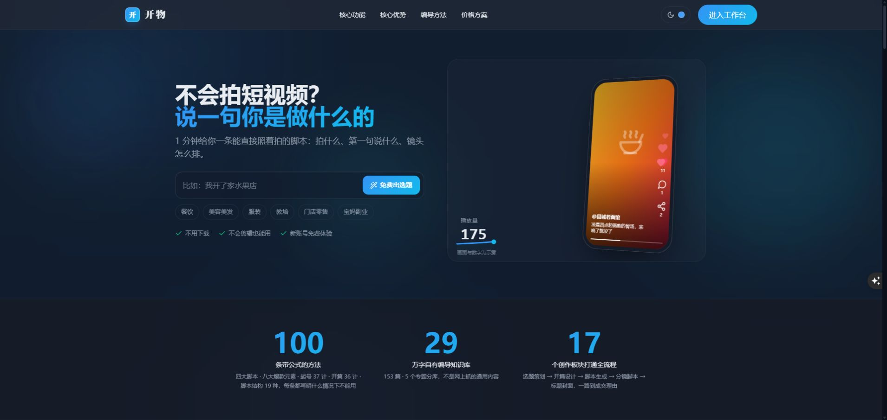
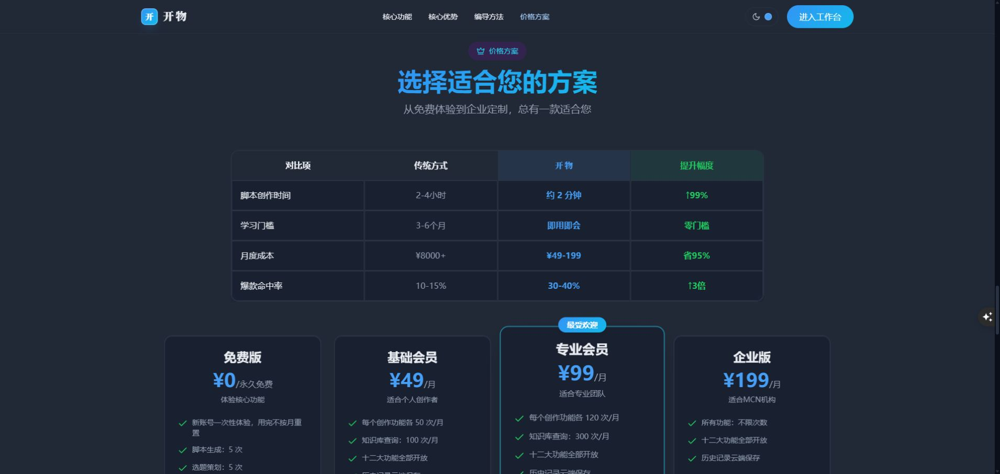

# 开物宣传页面审核与调整建议

日期：2026-09-30。范围：首页、搜索摘要、登录、价格、会员、支付、入门和隐私页面，以及现有闲鱼宣传资料。核对依据是当前代码、知识素材、实际功能与线上页面。**本轮只做审核与可替换文案建议，没有修改网站、套餐规则或发布新版本。** 按用户此前要求，发现的问题先汇报，由用户判断。

## 判断：需要调整，而且有值得放大的真实优势

开物已经具备客户档案、前采、编导方法、创作交接、视频拆解、跨行业二创和长期历史。这些能力能够组成清楚的产品故事：**围绕客户的生意创作，把编导方法落到具体内容，让每一轮成果积累下来。**

当前首页的“AI 智能生成”“专业级”“领先一步”较泛，档案与历史的优势没有占据核心位置；同时保留了几处数字矛盾和未经验证的效果承诺。建议把宣传重心放到可展示的能力和工作成果上，配合实际操作演示。

不需要先重做整个视觉体系。保留用户此前选择的“一句话开始”思路和现有品牌风格，先纠正说法、重排优势、补产品证据，效果更容易判断。

## 优先纠正的说法

| 位置与当前描述 | 判断与依据 | 建议 |
| --- | --- | --- |
| `app/layout.tsx:12`：“3秒生成专业级短视频脚本，达到MCN团队水平（25/35分）” | 线上 meta description 仍实际显示此文案。3 秒与现有生成链路、登录页的一两分钟说明不一致；25/35 没有公开可复核的对照评分依据。 | 换成产品能力摘要，见下方草案；宣传“创作工作台”，覆盖当前完整能力。 |
| `app/page.tsx:442`：“43 万字自有知识库” | 同页正文和 `lib/showcase.ts:173` 是 29。现有素材为 153 篇、5 个分库、296,464 全文字符。该字符数包含标点、Markdown 和英文，不能解释成 29 万纯汉字。 | 统一统计口径；主标题用“153 篇编导资料，覆盖 5 个专题”，字数作为辅助。 |
| 首页对比表 `app/page.tsx:760` 起：“2–4小时→约2分钟、↑99%”“省95%”“爆款命中率30–40%、↑3倍” | 线上实有此表。数字在代码中写死，没有找到样本、测量方法或经营结果来源；人工团队与软件订阅也不是相同服务范围。 | 删除未经验证的效果比例。改为比较实际工作能力：客户背景复用、方法选择、镜头表、创作接续、云端历史。 |
| 首屏 `TryHero.tsx:67,90`：“1分钟给完整脚本”“免费出选题” | 首屏按钮实际按关键词匹配预置行业样例，没有调用模型；右侧虽标注“示意样例”，主文案仍让人期待定制生成。 | 按钮改“查看行业样例”，紧接“注册后按你的档案生成完整内容”。固定时长承诺先撤掉，后续有实测再使用。 |
| `PhoneStory.tsx:49,242`：播放量动画增长到百万 | 数字为程序生成的演示。底部有小字说明，仍容易让访客形成经营效果预期。 | 保留动画形式，把结尾换为“选题、口播、镜头表、标题方案完成”，用具体产出增强说服力。 |
| 首页方法说明 `app/page.tsx:367,457,529`：“每条都写明情绪曲线、适用边界” | 100 条由 37 起号、36 开篇、19 脚本结构和 8 类元素组成；其中 19 种脚本结构有完整情绪曲线，其他类型并不都具有相同字段。 | “100 条公式与句式；19 种脚本结构另附情绪曲线与避坑说明。” |
| 首页 FAQ `app/page.tsx:257`：“100条”，括号只列37+36+19 | 举例合计 92，漏掉 8 类爆款元素句式。 | 补齐四组来源，避免同页数字不一致。 |
| 成交理由 `app/page.tsx:146`：“全站板块共用” | 当前背景清单只在选题、脚本、标题、二创开启成交理由输入。 | “保存到当前档案，选题、脚本、标题和二创会使用这些卖点。” |
| 分镜：“可视化分镜设计”；标题：“标题封面” | 当前产出主要为镜头文字表、拍摄清单及封面文字建议，没有自动生成分镜画面或封面图片的实现。 | 对外用“镜头表与拍摄清单”“标题与封面文案”，在示例中展示实际格式。 |
| 二创：“防搬运自查” | 当前是改写规则与模型给出的注意说明，未实现平台判重或版权检测。 | “借结构、换内容，附改写注意事项”，避免被理解为能通过平台检测的保证。 |
| 首页：“每一个环节”“一站式解决”；`app/page.tsx:744`：“企业定制” | 现有覆盖重点是内容策划、创作和拍摄准备，没有自动拍摄、剪辑成片、发布投流链路；企业版现有差异为使用次数。 | “贯通短视频创作主要环节”；套餐引导改“从免费体验到高频创作”。 |
| 首页、价格、会员：“最受欢迎” | 专业套餐徽章固定，没有销量或用户偏好统计依据。 | “适合持续创作”或“推荐方案”。 |

“内置编导知识库”可以由材料和实现证明；“自有、独家、原创版权”涉及另一层事实，目前代码不能证明资料权利归属。未经资料授权核对，建议使用“内置编导知识体系”，也不建议增加“自研大模型、专属训练模型”等无实现依据的说法。

## 应放在首页主位的四项优势

| 主张 | 用户能获得的价值 | 实际依据 |
| --- | --- | --- |
| **围绕你的生意创作** | 行业、人群、口吻、卖点、禁忌和拍摄条件成为后续创作背景，减少每次重新解释客户。 | `lib/creator-context.ts:209`、`lib/context-manifest.ts:58` 起；前采还有原文依据和人工核对。 |
| **把编导方法用进内容** | 可选起号打法、开篇、脚本结构和表达句式；具体公式参与生成，选择有方向。 | `lib/showcase.ts:135` 起；对应方法库、提示词及 `tests/showcase.test.ts`。100 为37+36+19+8。 |
| **从参考到可拍方案** | 选题接脚本，脚本接分镜；参考视频结合画面与口播拆解，结果可带去二创，按当前档案行业和产品改写。 | `lib/handoff.ts`、`lib/video-frames.ts`、`lib/viral-breakdown.ts`、`lib/remix.ts`。 |
| **每个客户都有创作积累** | 按账号和档案存历史，恢复旧稿和设置，继续细化；拆解、二创后续生成参考近期成果。 | `lib/creative-history.ts:13,33`、`hooks/useCreativeHistory.ts`、两项页面的上方历史入口。 |

技术介绍可以具体说成：**专业知识检索、客户背景组织、任务规则和云端历史共同支撑创作。** 对用户分别意味着“有方法依据、围绕真实客户、输出有结构、成果能找回”。`app/api/dify/stream/route.ts:98` 将知识检索的短查询与生成长指令分离，`lib/creator-context.ts` 按任务组织背景，拆解二创再加入当前档案的历史参考。适合在页面中用一张简短流程图解释，不需要堆技术名词。

宣传边界应与功能一致：保存全部历史不等于模型每次读取全部历史。拆解、二创目前参考最近 8 条节选，每条最多 1200 字；选题等还刻意隔离会话。推荐说“按档案积累历史，后续创作参考近期成果”，不说“无限记忆、永不重复”。视频拆解目前分析前 3 分钟，不宣传任意长度全片解析或直接解析平台链接。

## 首页调整顺序

1. **首屏讲用途与对象。** 保留“一句话开始”互动，把“实体商家、编导、代运营”说清楚；示例按钮和真实注册体验分清。
2. **尽快给产品证据。** 展示一个明确标识的演示档案及实际操作：背景 → 选题 → 口播 → 镜头表 → 历史恢复。客户私有内容不直接当公开案例。
3. **四项优势解释为什么有用。** 用上表四项替换当前较泛的“AI智能生成”等核心卡片。
4. **把拆解与二创做成重点演示。** 展示一条参考内容如何拆、用户怎样选借哪几层、如何落到当前行业；说明文字和操作界面同时出现。
5. **方法与素材作为支撑。** 保留方法样例、100 条公式、153 篇资料、5 个专题等证据；不要把字数当唯一主卖点。
6. **功能按任务分组。** “认识客户、策划内容、写成可拍方案、拆解与迁移、保存与继续”比一口气读完许多功能卡更容易理解。17 个创作板块的目录计数成立，不需要机械地堆满17张卡。
7. **价格讲工作量和额度。** 免费体验、基础常规使用、专业持续创作、企业高频使用；说明功能共享与额度差异，最后给常见问题及注册入口。

这套顺序是针对当前页面的产品表达建议，没有实测转化提升比例。视觉风格可以沿用，优先改变信息重点。

## 可直接评审的文案草案

### 首屏

定位标签：**面向实体商家、编导与代运营的 AI 创作工作台**

保留原来的主标题：

> 不会拍短视频？
> 说一句你是做什么的

副标题建议：

> 围绕你的行业、产品和客户，找选题、写口播、排镜头、起标题。把生意里的卖点，变成一套可拍的内容方案。

示例按钮：**查看行业样例**

注册入口：**免费注册，开始创作**

辅助说明：**多档案切换 · 编导方法可选 · 历史云端保存**

面向专业用户的补充句：

> 同时服务多个客户，也能分别保存背景和成果，让每个账号的内容有自己的方向。

### 核心优势卡

**围绕你的生意创作**

> 从前采到客户档案，把人群、定位、口吻和卖点整理清楚。选题、脚本等创作会参考当前档案，让方案落到真实客户身上。

**把方法用进内容**

> 100 条公式与句式，覆盖起号、开篇、脚本结构和爆款元素。选择需要的打法，让创作方向和结构更清楚。

**拆懂参考，改成自己的内容**

> 结合画面与口播分析开篇、结构和镜头，再选择借哪几层。二创围绕当前档案的产品、场景与人物来写。

**每个客户都有创作积累**

> 拆解报告和二创方案按账号、档案保存，点击历史恢复内容和设置。新一轮创作参考近期成果，旧稿也能重新打开继续细化。

### 搜索摘要

建议标题：**开物｜围绕客户档案的 AI 编导工作台**

建议摘要：

> 为实体商家、编导和代运营提供定位、选题、脚本、分镜、视频拆解与跨行业二创。结合编导方法和客户档案，创作成果云端保存。

### 用真实能力替换效果对比表

| 创作需要 | 开物如何支持 | 可以展示的证据 |
| --- | --- | --- |
| 理解客户 | 前采提取、原文核对、账号档案与简报 | 原文依据、确认后的档案 |
| 找到写法 | 起号、开篇、结构和元素可选 | 方法卡与实际生成结构 |
| 准备拍摄 | 口播内容、镜头表、动作道具与时长核对 | 脚本及分镜结果 |
| 学会迁移 | 视频拆解、11 个二创层次可选 | 拆解报告和二创设置 |
| 积累成果 | 档案历史、恢复与继续创作 | 历史数量、旧稿恢复 |

此表比较的是产品提供的能力，不把软件订阅等同于完整人工团队服务。

## 价格、开通与隐私的配套调整

- `app/pricing/page.tsx:36` 的“升级到更强大的功能”，与同页“功能本身一样”不一致。建议“核心创作功能均可体验，按创作频率选择额度”。专业版可以说明创作额度是基础版的 2.4 倍、知识查询是 3 倍；这些是配置数值，不是生成质量倍数。
- `lib/config/plans.ts:243,298` 的“每个创作功能各50/120次”“十二大功能”，与17板块采用不同口径。建议统一对外说“全部创作板块开放，按额度类别分别计量，部分板块共享次数”，表下说明定位各页共用定位额度、脚本/起号/开篇共用脚本额度。
- 免费版是一次性体验额度，账户和历史可以继续保留；“永久免费”容易与每月免费额度混淆，推荐“免费体验”。
- `app/pricing/page.tsx:179` 的“升级后立即生效”应与人工审核一致，改“管理员核对开通后生效”。`app/payment/page.tsx:316`“通常当天处理”需要实际服务时间支撑，不能仅由代码确定。
- 网站会员按月计算，旧闲鱼文案有固定30天，注册开通路径也保留固定30天计算。新图片指南已发现，但旧销售文字未统一。期限规则需用户决定后同步代码、商品说明、图片和客服话术；本轮没有改变期限。
- 首页 FAQ 的“传输均加密”与当前 HTTP IP 入口不一致；“不会用于AI训练”需要实际供应商条款及配置支撑；“导出所有历史”未找到全量导出入口。建议先用已证实的“按账号隔离，可查看、复制和删除历史”。
- 隐私页对素材保留、处理供应链和浏览器存储的说明需要同步：截图上传 Dify，本项目没有删除第三方文件的流程；转写链路注释还涉及 SiliconFlow；新补存机制会临时在本机保存待补存输入和正文。需要核实实际配置再写完整政策，不能用“零保留”替代核查。

闲鱼资料建议同步加入“拆解→跨行业二创→按档案保存历史”，避免官网与销售页面仍停留在选题、脚本、分镜的旧介绍。

## 先报告的功能与技术问题

**分镜到标题的正文承接有断点。** `app/dashboard/storyboard/page.tsx:500` 传出 scriptContent，但 `app/dashboard/title/page.tsx:115` 的接收逻辑没有接它；`:214` 的标题提示词也没有使用脚本正文。即使作品恢复设置了 scriptContent，当前生成主要仍围绕主题。需要单独修复和验证，再更完整地宣传这一段流程；没有把功能修复夹在本轮文案建议里实施。

**首页内容依赖客户端挂载。** `app/page.tsx:92` 在 mounted 之前返回 null。搜索摘要虽可输出，宣传主体需脚本加载后出现，建议后续单独验证搜索抓取及分享预览、评估将静态宣传内容服务端渲染。当前没有据此断言搜索引擎完全无法收录。

## 验证记录

已在真实线上首页确认：首屏1分钟承诺、43/29万字矛盾、效果对比数字及专业套餐徽章都实际可见；meta description 也仍为3秒及MCN评分。相关截图如下。审核没有调用付费模型，没有修改客户数据、套餐或网站源码，因此没有重跑与本轮无关的整套测试。

建议分两轮落地：先统一准确口径、替换核心优势和补历史描述；再补实际功能演示、调整动画及页面顺序。期限规则、供应商数据条款和上述正文承接问题分别处理，发布前重新核对官网与销售资料。
