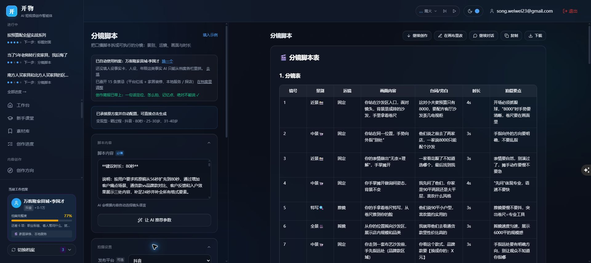

# 开物数据库迁移与正式上线验收（2026-10-04）

用户已明确授权接续 Claude 未完成事项、执行数据库迁移并上线。保持原视觉与会员价格，未重置 Git 工作树或删除历史。

## 本地验证

- 重新运行全量测试：2366 项通过，0 失败。日志 `.tmp/predeploy-tests_final_20261004.json`。
- 全项目类型检查通过。
- 全项目 Lint：0 错误、559 个既有警告；本次追加修复文件的定向 Lint 通过。
- 初版本地产物与各次正式服务器构建通过。服务通过健康检查后才切换；旧目录保留用于回滚。

## 正式数据库

项目 `nxxbzdstmtuyplcwrrhs`，通过已登录 Supabase SQL Editor 执行：

1. `20261003_creation_quota_reservations.sql`
2. `20261004_creation_completion_evidence.sql`
3. `20261003_creation_sessions.sql`
4. `20261003_library_assets.sql`
5. `20261003_creator_presets.sql`
6. `20261004_legacy_view_permissions.sql`（上线核查发现的旧视图权限修复）

执行前核验现有 works、user_profiles、user_quotas、usage_events、subscriptions、admin_logs 与 material_library 及所需字段。迁移执行成功，不清空用户内容或现有次数。

核验结果：

- 新建表 RLS 开启。
- 预占、结算、完成证据与对账 RPC：anon/authenticated 无执行权，service_role 有执行权。
- 创作接续 RPC：匿名无执行权，登录用户有执行权。
- 在正式库 **ROLLBACK 事务**中验证接续创建/同请求重试，以及配额预占、完成证据、幂等结算和使用事件只记一次。事务中的测试记录和次数修改均回滚。
- 两个旧视图 archive_summary / v_user_account_status 原来使用视图所有者权限，匿名及普通会员可读取档案和邮箱。现仅服务器有读取权限；当前应用代码没有使用这些客户端入口。匿名 REST 实测均返回 401。

## 实际页面与生成

- 已登录正式首页可刷新正常加载，新接续入口显示，原档案和历史保留。
- 创作进度列表、分组计数、已有作品拍摄交付包正常读取；缺分镜/标题时明确提示，没有自动编造。
- 高阶自由新建一条明确命名的上线验收对话，不联网：模型返回“开物上线验收通过”，显示已同步云端，刷新恢复成功。
- 对应数据库记录：feature=freeChat、status=committed、terminal=workflow_finished、正文8字、usage_events 数量=1。联网额度仍为143/150，没有因这次关闭联网的验收减少。
- 六附件正式 Dify parameters：HTTP 200、file_upload enabled=true、number_limits=6、类型 image/document。
- 未登录网站生成需求、预设、改稿与导出 API 按真实方法返回 401；登录页 HTTP 200。
- 审稿→分镜实际跳转后，输入完整优化稿2291字，自动设置为80秒且生成按钮可用；一键生成27个镜头，系统逐镜合计79秒/目标80秒。对应服务端证据 status=committed、terminal=workflow_finished、4068字、使用事件仅1条。保留原审稿和新增分镜历史，没有覆盖原稿。
- 素材库真实读取当前档案3条收藏和24条产出，风格预设正常读到空列表，没有缺表报错。

## 实测追加修复

- 审稿总评、评分、问题清单及分镜表、自检、拍摄清单等报告章节原被列成五份脚本：候选识别改为使用优化正文；整份报告仍保留为来源。
- 旧历史的“AI 推荐时长”占位值原会覆盖最终稿的精确时长：移除无效占位时长，并允许从来源正文恢复。用户明确指定的时长仍优先。
- 已追加行为测试：报告章节不是候选脚本、带入完整优化稿、80秒自动建议不会被占位值覆盖、45秒明确用户要求仍优先。

## 发布与回滚

正式运行目录保持 `/var/www/xiaosong-web`，PM2 `xiaosong-web`。

独立目录复制现有环境及文件、解压新源码、npm ci、构建，完成后停旧进程、保留旧目录并切换；健康检查失败自动移回旧目录。保持现有环境变量，不输出密钥。

回滚副本：

- `/var/www/xiaosong-backup-20261004_optimization`（本轮上线前原版）
- `/var/www/xiaosong-backup-20261004_selection_fix`
- `/var/www/xiaosong-backup-20261004_duration_fix`
- `/var/www/xiaosong-backup-20261004_final`

发布日志：`/tmp/kaiwu-release_20261004.log`、`/tmp/kaiwu-selection_fix_20261004.log`、`/tmp/kaiwu-duration_fix_20261004.log`、`/tmp/kaiwu-final_20261004.log`。本地接口报告 `docs/上线接口验收_20261004.json`。

最终构建 ID：`CEcL9UHgzweHts63Dntej`。PM2 进程在线，PID `225861`，正式站 http://122.51.234.155 。关键修复文件的本地与服务器 SHA256 一致，最终接口检查全部通过。

最终刷新正式分镜页后，80秒选项、27镜头结果与1条分镜历史均恢复；报告章节未再误列为五份候选脚本。

## 交付范围与剩余边界

本次上线为 Claude 已完成的阶段1—3及上述追加修复，不代表所有长期规划都已实现。团队协作、自动视频/剪辑/平台发布、导出文件写回恢复、HTTPS域名，以及管理员对账的定时调度仍待后续实现或外部条件。现有 Dify 线上工作流未被重新导入；本地旧 Tavily 标准 DSL 与最新阿里云 DSL 的整理仍见 Claude 报告，不应导入旧文件。

真实多设备、所有板块两两组合、全部附件格式和所有模型的效果未在本轮逐一重新生成；不能把单次连通性与自动测试说成每一种创作结果均已人工验收。
